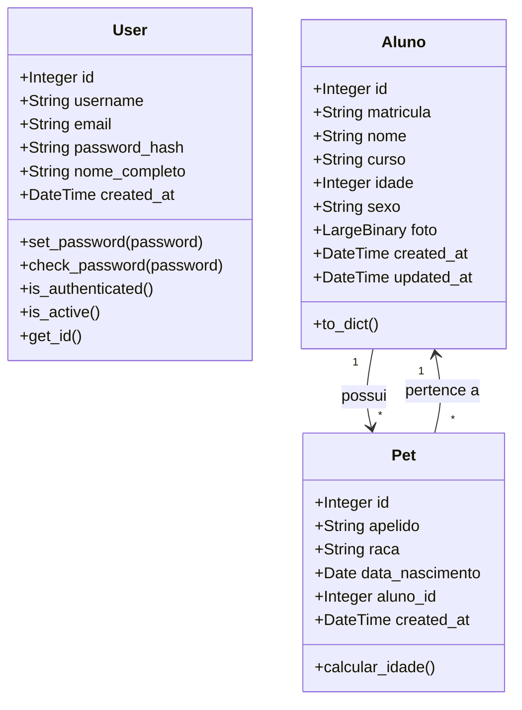
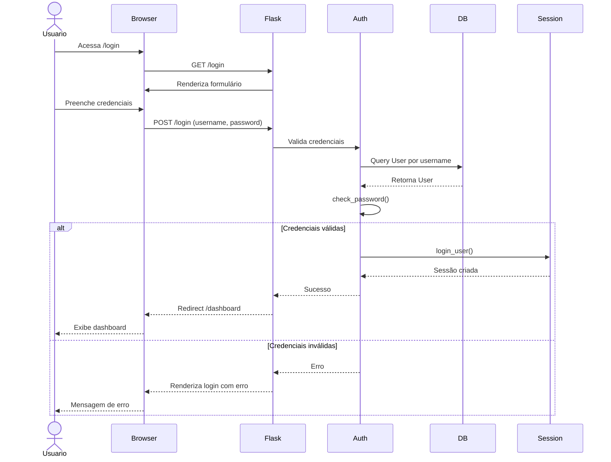
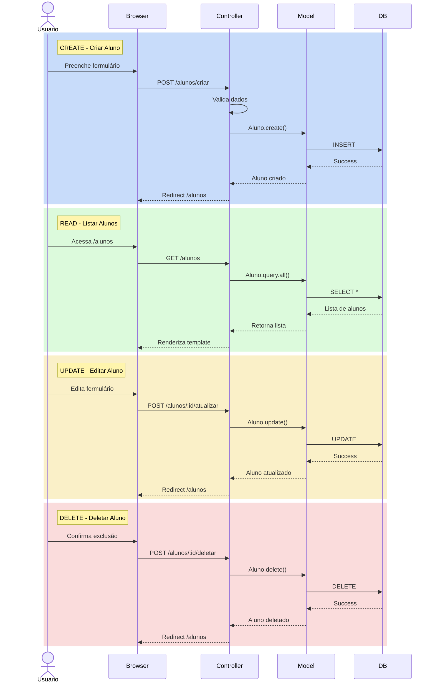
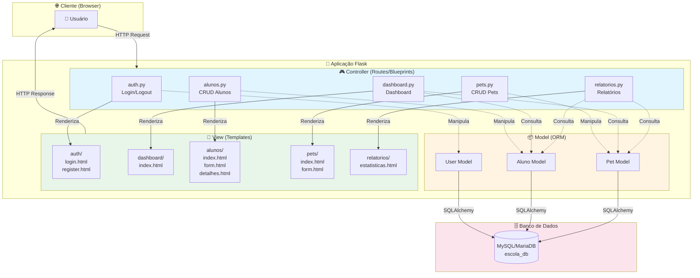
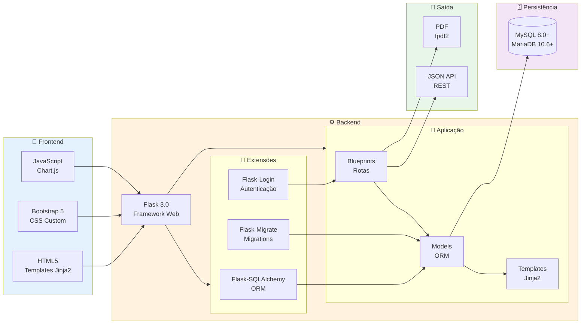
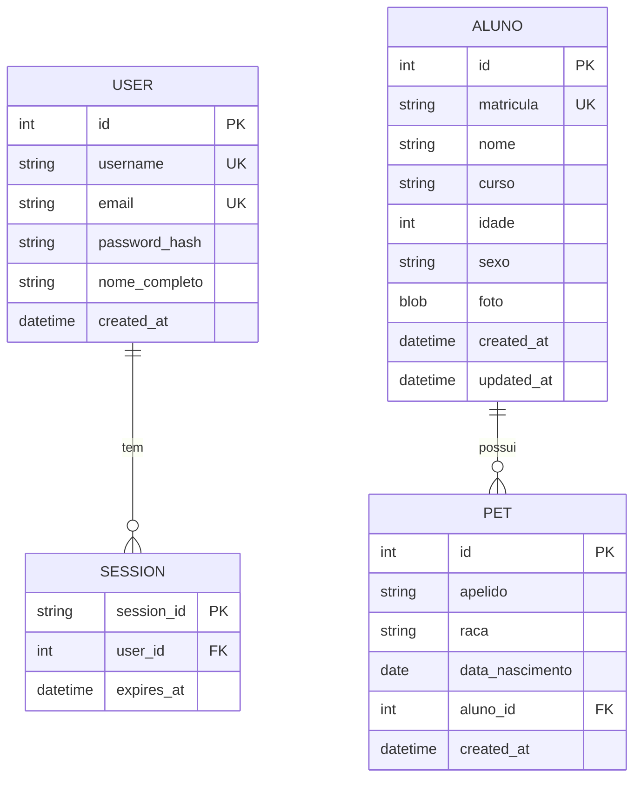
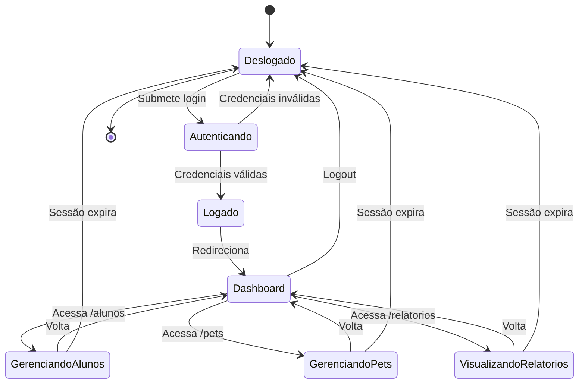

# Sistema de Gestão Escolar - Flask MVC CRUD


## Índice

- [Sistema de Gestão Escolar - Flask MVC CRUD](#sistema-de-gestão-escolar---flask-mvc-crud)
  - [Índice](#índice)
  - [Sobre o Projeto](#sobre-o-projeto)
  - [Tecnologias Utilizadas](#tecnologias-utilizadas)
    - [Backend](#backend)
    - [Frontend](#frontend)
    - [Banco de Dados](#banco-de-dados)
    - [Ferramentas de Desenvolvimento](#ferramentas-de-desenvolvimento)
  - [Arquitetura MVC](#arquitetura-mvc)
    - [**Model (Modelo)**](#model-modelo)
    - [**View (Visão)**](#view-visão)
    - [**Controller (Controlador)**](#controller-controlador)
  - [Funcionalidades](#funcionalidades)
    - [Autenticação e Segurança](#autenticação-e-segurança)
    - [Dashboard Interativo](#dashboard-interativo)
    - [CRUD de Alunos](#crud-de-alunos)
    - [CRUD de Pets](#crud-de-pets)
    - [Sistema de Relatórios](#sistema-de-relatórios)
    - [Interface Moderna](#interface-moderna)
  - [Estrutura do Projeto](#estrutura-do-projeto)
  - [Pré-requisitos](#pré-requisitos)
    - [Verificar instalação:](#verificar-instalação)
  - [Instalação](#instalação)
    - [1. Clonar o repositório](#1-clonar-o-repositório)
    - [2. Criar ambiente virtual](#2-criar-ambiente-virtual)
    - [3. Ativar ambiente virtual](#3-ativar-ambiente-virtual)
    - [4. Instalar dependências](#4-instalar-dependências)
    - [5. Verificar instalação](#5-verificar-instalação)
  - [Configuração](#configuração)
    - [1. Criar banco de dados](#1-criar-banco-de-dados)
    - [2. Configurar variáveis de ambiente](#2-configurar-variáveis-de-ambiente)
    - [3. Inicializar banco de dados](#3-inicializar-banco-de-dados)
    - [4. Criar usuário administrador](#4-criar-usuário-administrador)
    - [5. Popular banco com dados de exemplo (opcional)](#5-popular-banco-com-dados-de-exemplo-opcional)
  - [Uso](#uso)
    - [Executar a aplicação](#executar-a-aplicação)
    - [Acessar o sistema](#acessar-o-sistema)
    - [Comandos Flask disponíveis](#comandos-flask-disponíveis)
  - [Diagramas UML](#diagramas-uml)
    - [Diagrama de Classes (Modelos de Dados)](#diagrama-de-classes-modelos-de-dados)
    - [Diagrama de Sequência - Processo de Login](#diagrama-de-sequência---processo-de-login)
    - [Diagrama de Sequência - CRUD de Aluno](#diagrama-de-sequência---crud-de-aluno)
    - [Diagrama de Fluxo - Arquitetura MVC](#diagrama-de-fluxo---arquitetura-mvc)
    - [Diagrama de Componentes - Estrutura da Aplicação](#diagrama-de-componentes---estrutura-da-aplicação)
    - [Diagrama Entidade-Relacionamento (ER)](#diagrama-entidade-relacionamento-er)
    - [Diagrama de Estados - Ciclo de Vida de uma Sessão](#diagrama-de-estados---ciclo-de-vida-de-uma-sessão)
  - [Modelos de Dados](#modelos-de-dados)
    - [User (Usuário)](#user-usuário)
    - [Aluno](#aluno)
    - [Pet](#pet)
  - [Rotas e Endpoints](#rotas-e-endpoints)
    - [Autenticação](#autenticação)
    - [Dashboard](#dashboard)
    - [Alunos](#alunos)
    - [Pets](#pets)
    - [Relatórios](#relatórios)
  - [Licença](#licença)
  - [Autor](#autor)
  - [Contribuindo](#contribuindo)
  - [Suporte](#suporte)

---

## Sobre o Projeto

Sistema completo de **gestão escolar** desenvolvido em **Python** com o framework **Flask**, implementando o padrão arquitetural **MVC (Model-View-Controller)**. O sistema oferece funcionalidades de CRUD (Create, Read, Update, Delete) para gerenciamento de alunos e pets, com autenticação de usuários, dashboard com estatísticas em tempo real, e geração de relatórios em PDF.

Este projeto demonstra as melhores práticas de desenvolvimento web com Flask, incluindo:

- Arquitetura modular com Blueprints
- ORM com SQLAlchemy
- Autenticação segura com Flask-Login
- Interface responsiva com Bootstrap 5
- Geração dinâmica de relatórios
- Validação de dados e segurança


---

## Tecnologias Utilizadas

### Backend
- **Python 3.11+** - Linguagem de programação
- **Flask 3.0+** - Framework web minimalista
- **Flask-SQLAlchemy 3.1+** - ORM para banco de dados
- **Flask-Login 0.6+** - Gerenciamento de autenticação
- **Flask-Migrate 4.0+** - Migrations de banco de dados
- **MySQL Connector** - Driver para MySQL/MariaDB
- **Werkzeug** - Utilitários WSGI e hash de senhas
- **python-dotenv** - Gerenciamento de variáveis de ambiente

### Frontend
- **Bootstrap 5** - Framework CSS responsivo
- **Chart.js** - Biblioteca de gráficos interativos
- **Jinja2** - Template engine
- **HTML5/CSS3** - Marcação e estilização
- **JavaScript ES6+** - Interatividade

### Banco de Dados
- **MySQL 8.0+** ou **MariaDB 10.6+**
- **SQLAlchemy ORM** - Abstração de banco de dados

### Ferramentas de Desenvolvimento
- **Git** - Controle de versão
- **Virtual Environment (venv)** - Isolamento de dependências
- **fpdf2** - Geração de relatórios PDF

---

## Arquitetura MVC

O projeto segue rigorosamente o padrão **MVC (Model-View-Controller)**:

### **Model (Modelo)**
Localização: `app/models/`

Define a estrutura de dados e lógica de negócios:
- `user.py` - Modelo de usuários com autenticação
- `aluno.py` - Modelo de alunos com validações
- `pet.py` - Modelo de pets com relacionamento N:1 com alunos

### **View (Visão)**
Localização: `app/templates/`

Templates HTML com Jinja2 para renderização:
- `base.html` - Template base com layout comum
- `auth/` - Templates de login e registro
- `dashboard/` - Dashboard com estatísticas
- `alunos/` - Listagem, formulários e detalhes de alunos
- `pets/` - Gerenciamento de pets
- `relatorios/` - Visualização e geração de relatórios

### **Controller (Controlador)**
Localização: `app/routes/`

Blueprints que controlam o fluxo da aplicação:
- `auth.py` - Autenticação (login/logout/registro)
- `dashboard.py` - Dashboard e estatísticas
- `alunos.py` - CRUD de alunos
- `pets.py` - CRUD de pets
- `relatorios.py` - Geração de relatórios

---

## Funcionalidades

### Autenticação e Segurança
- Sistema de login e registro de usuários
- Senhas hasheadas com Werkzeug (bcrypt)
- Sessões seguras com Flask-Login
- Proteção de rotas com decorador `@login_required`
- Cookies seguros e HTTPOnly

### Dashboard Interativo
- Cards com estatísticas em tempo real
- Total de alunos cadastrados
- Total de pets registrados
- Distribuição de alunos por curso (gráfico de pizza)
- Distribuição por sexo (gráfico de barras)
- Gráficos interativos com Chart.js

### CRUD de Alunos
- Listagem com busca e filtros
- Cadastro completo com validação
- Upload e armazenamento de fotos em BLOB
- Edição de dados
- Visualização detalhada
- Exclusão com confirmação
- Paginação de resultados

### CRUD de Pets
- Relacionamento N:1 com alunos
- Cadastro vinculado ao proprietário
- Dados: apelido, raça, data de nascimento
- Listagem com informações do aluno
- Edição e exclusão

### Sistema de Relatórios
- **PDF Dinâmico**: Geração com fpdf2
  - Lista completa de alunos formatada
  - Cabeçalho e rodapé personalizados
  - Download automático

- **Estatísticas**: Dashboard com gráficos
  - Distribuição por curso
  - Distribuição por sexo
  - Alunos com e sem pets

- **Exportação JSON**: API REST
  - Endpoint: `/api/alunos/json`
  - Dados estruturados para integração

- **Relatório Mestre-Detalhe**:
  - Alunos com lista de pets
  - Relacionamento hierárquico

### Interface Moderna
- Design responsivo (mobile-first)
- Bootstrap 5 com componentes personalizados
- Ícones e animações
- Feedback visual (alerts, toasts)
- Tabelas estilizadas e ordenáveis
- Formulários com validação client-side

---

## Estrutura do Projeto

```
exemplo_python_CRUD_MVC_flask_v2/
│
├── app/                          # Aplicação principal
│   ├── __init__.py              # Factory da aplicação
│   │
│   ├── models/                  # Camada Model (ORM)
│   │   ├── __init__.py
│   │   ├── user.py              # Modelo User (autenticação)
│   │   ├── aluno.py             # Modelo Aluno
│   │   └── pet.py               # Modelo Pet
│   │
│   ├── routes/                  # Camada Controller (Blueprints)
│   │   ├── __init__.py
│   │   ├── auth.py              # Rotas de autenticação
│   │   ├── dashboard.py         # Dashboard
│   │   ├── alunos.py            # CRUD de alunos
│   │   ├── pets.py              # CRUD de pets
│   │   └── relatorios.py        # Relatórios e exportações
│   │
│   ├── templates/               # Camada View (HTML)
│   │   ├── base.html            # Template base
│   │   ├── auth/                # Templates de autenticação
│   │   │   ├── login.html
│   │   │   └── register.html
│   │   ├── dashboard/
│   │   │   └── index.html
│   │   ├── alunos/              # Templates de alunos
│   │   │   ├── index.html       # Listagem
│   │   │   ├── form.html        # Formulário
│   │   │   └── detalhes.html    # Detalhes
│   │   ├── pets/                # Templates de pets
│   │   │   ├── index.html
│   │   │   └── form.html
│   │   └── relatorios/          # Templates de relatórios
│   │       ├── index.html
│   │       ├── estatisticas.html
│   │       └── mestre_detalhe.html
│   │
│   └── static/                  # Arquivos estáticos
│       ├── css/                 # Estilos CSS
│       ├── js/                  # Scripts JavaScript
│       └── uploads/             # Upload de imagens
│
├── migrations/                  # Migrations do Flask-Migrate
├── logs/                        # Arquivos de log
├── venv/                        # Ambiente virtual (não versionado)
│
├── config.py                    # Configurações da aplicação
├── run.py                       # Script principal de execução
├── requirements.txt             # Dependências Python
├── .env                         # Variáveis de ambiente (não versionado)
├── .env.example                 # Exemplo de configuração
├── .gitignore                   # Arquivos ignorados pelo Git
└── README.md                    # Este arquivo
```

---

## Pré-requisitos

Antes de iniciar, certifique-se de ter instalado:

- **Python 3.11+** - [Download Python](https://www.python.org/downloads/)
- **MySQL 8.0+** ou **MariaDB 10.6+** - [Download MySQL](https://dev.mysql.com/downloads/)
- **Git** - [Download Git](https://git-scm.com/downloads)
- **pip** - Gerenciador de pacotes Python (incluído com Python)

### Verificar instalação:

```bash
python --version
pip --version
mysql --version
git --version
```

---

## Instalação

### 1. Clonar o repositório

```bash
git clone https://github.com/monteiro74/exemplo_python_CRUD_MVC_flask_v2.git
cd exemplo_python_CRUD_MVC_flask_v2
```

### 2. Criar ambiente virtual

```bash
python -m venv venv
```

### 3. Ativar ambiente virtual

**Windows:**
```bash
venv\Scripts\activate
```

**Linux/macOS:**
```bash
source venv/bin/activate
```

Você verá `(venv)` no início da linha de comando.

### 4. Instalar dependências

```bash
pip install -r requirements.txt
```

### 5. Verificar instalação

```bash
pip list
```

Pacotes esperados:
- Flask
- Flask-SQLAlchemy
- Flask-Login
- Flask-Migrate
- mysql-connector-python
- fpdf2
- python-dotenv

---

## Configuração

### 1. Criar banco de dados

Entre no MySQL/MariaDB:

```bash
mysql -u root -p
```

Execute:

```sql
CREATE DATABASE escola_db CHARACTER SET utf8mb4 COLLATE utf8mb4_unicode_ci;
```

Crie um usuário (opcional, mas recomendado):

```sql
CREATE USER 'admin_escola'@'localhost' IDENTIFIED BY 'sua_senha_segura';
GRANT ALL PRIVILEGES ON escola_db.* TO 'admin_escola'@'localhost';
FLUSH PRIVILEGES;
EXIT;
```

### 2. Configurar variáveis de ambiente

Copie o arquivo de exemplo:

```bash
copy .env.example .env     # Windows
cp .env.example .env       # Linux/macOS
```

Edite o arquivo `.env`:

```env
# Configurações do Flask
FLASK_APP=run.py
FLASK_ENV=development
SECRET_KEY=sua-chave-secreta-super-segura-mude-em-producao

# Configurações do Banco de Dados
DB_HOST=localhost
DB_PORT=3306
DB_NAME=escola_db
DB_USER=admin_escola
DB_PASSWORD=sua_senha_segura

# Configurações de Upload
UPLOAD_FOLDER=app/static/uploads
MAX_CONTENT_LENGTH=16777216
ALLOWED_EXTENSIONS=png,jpg,jpeg,gif
```

**Importante:**
- NUNCA commite o arquivo `.env` no Git
- Altere `SECRET_KEY` para uma chave aleatória e segura
- Use senhas fortes para o banco de dados

### 3. Inicializar banco de dados

```bash
flask init-db
```

### 4. Criar usuário administrador

```bash
flask create-admin
```

Credenciais padrão:
- **Username:** admin
- **Password:** admin123

**Importante:** Altere a senha após o primeiro login!

### 5. Popular banco com dados de exemplo (opcional)

```bash
flask seed-db
```

Isso criará:
- 5 alunos de exemplo
- 4 pets vinculados aos alunos

---

## Uso

### Executar a aplicação

```bash
python run.py
```

A aplicação estará disponível em:
```
http://localhost:5000
```

### Acessar o sistema

1. Abra o navegador em `http://localhost:5000`
2. Faça login com as credenciais:
   - **Username:** admin
   - **Password:** admin123
3. Explore o dashboard e funcionalidades

### Comandos Flask disponíveis

```bash
flask init-db          # Inicializar banco de dados
flask create-admin     # Criar usuário admin
flask seed-db          # Popular com dados de exemplo
flask shell            # Abrir shell interativo
flask routes           # Listar todas as rotas
```

---

## Diagramas UML

### Diagrama de Classes (Modelos de Dados)



### Diagrama de Sequência - Processo de Login



### Diagrama de Sequência - CRUD de Aluno



### Diagrama de Fluxo - Arquitetura MVC



### Diagrama de Componentes - Estrutura da Aplicação



### Diagrama Entidade-Relacionamento (ER)



### Diagrama de Estados - Ciclo de Vida de uma Sessão



---

## Modelos de Dados

### User (Usuário)

**Tabela:** `users`

| Campo          | Tipo         | Descrição                    |
|----------------|--------------|------------------------------|
| id             | Integer (PK) | Identificador único          |
| username       | String(80)   | Nome de usuário (único)      |
| email          | String(120)  | E-mail (único)               |
| password_hash  | String(255)  | Senha hasheada               |
| nome_completo  | String(150)  | Nome completo                |
| created_at     | DateTime     | Data de criação              |

**Métodos:**
- `set_password(password)` - Hash de senha
- `check_password(password)` - Verificação de senha

### Aluno

**Tabela:** `alunos`

| Campo         | Tipo         | Descrição                    |
|---------------|--------------|------------------------------|
| id            | Integer (PK) | Identificador único          |
| matricula     | String(20)   | Matrícula (único)            |
| nome          | String(100)  | Nome completo                |
| curso         | String(100)  | Curso                        |
| idade         | Integer      | Idade                        |
| sexo          | String(1)    | Sexo (M/F)                   |
| foto          | LargeBinary  | Foto em BLOB                 |
| created_at    | DateTime     | Data de cadastro             |
| updated_at    | DateTime     | Última atualização           |

**Relacionamento:**
- `pets` - Lista de pets (1:N)

### Pet

**Tabela:** `pets`

| Campo            | Tipo         | Descrição                    |
|------------------|--------------|------------------------------|
| id               | Integer (PK) | Identificador único          |
| apelido          | String(50)   | Apelido do pet               |
| raca             | String(50)   | Raça                         |
| data_nascimento  | Date         | Data de nascimento           |
| aluno_id         | Integer (FK) | ID do aluno proprietário     |
| created_at       | DateTime     | Data de cadastro             |

**Relacionamento:**
- `aluno` - Aluno proprietário (N:1)

---

## Rotas e Endpoints

### Autenticação

| Método | Rota           | Descrição              | Autenticação |
|--------|----------------|------------------------|--------------|
| GET    | /login         | Exibe formulário login | Não          |
| POST   | /login         | Processa login         | Não          |
| GET    | /register      | Exibe formulário       | Não          |
| POST   | /register      | Cria novo usuário      | Não          |
| GET    | /logout        | Faz logout             | Sim          |

### Dashboard

| Método | Rota           | Descrição              | Autenticação |
|--------|----------------|------------------------|--------------|
| GET    | /              | Dashboard principal    | Sim          |
| GET    | /dashboard     | Dashboard principal    | Sim          |

### Alunos

| Método | Rota                  | Descrição                  | Autenticação |
|--------|-----------------------|----------------------------|--------------|
| GET    | /alunos               | Lista todos os alunos      | Sim          |
| GET    | /alunos/novo          | Formulário novo aluno      | Sim          |
| POST   | /alunos/criar         | Cria aluno                 | Sim          |
| GET    | /alunos/<id>          | Detalhes do aluno          | Sim          |
| GET    | /alunos/<id>/editar   | Formulário de edição       | Sim          |
| POST   | /alunos/<id>/atualizar| Atualiza aluno             | Sim          |
| POST   | /alunos/<id>/deletar  | Deleta aluno               | Sim          |

### Pets

| Método | Rota                  | Descrição                  | Autenticação |
|--------|-----------------------|----------------------------|--------------|
| GET    | /pets                 | Lista todos os pets        | Sim          |
| GET    | /pets/novo            | Formulário novo pet        | Sim          |
| POST   | /pets/criar           | Cria pet                   | Sim          |
| GET    | /pets/<id>/editar     | Formulário de edição       | Sim          |
| POST   | /pets/<id>/atualizar  | Atualiza pet               | Sim          |
| POST   | /pets/<id>/deletar    | Deleta pet                 | Sim          |

### Relatórios

| Método | Rota                      | Descrição                  | Autenticação |
|--------|---------------------------|----------------------------|--------------|
| GET    | /relatorios               | Menu de relatórios         | Sim          |
| GET    | /relatorios/pdf           | Gera PDF de alunos         | Sim          |
| GET    | /relatorios/estatisticas  | Estatísticas gráficas      | Sim          |
| GET    | /relatorios/mestre-detalhe| Relatório alunos/pets      | Sim          |
| GET    | /api/alunos/json          | Exporta JSON               | Sim          |

---


---

## Licença

Este projeto está sob a licença MIT. Consulte o arquivo LICENSE para mais detalhes.

---

## Autor

**Monteiro74**
- GitHub: [@monteiro74](https://github.com/monteiro74)
- Repositório: [exemplo_python_CRUD_MVC_flask_v2](https://github.com/monteiro74/exemplo_python_CRUD_MVC_flask_v2)

---

## Contribuindo

Contribuições são bem-vindas! Sinta-se à vontade para:

1. Fazer um fork do projeto
2. Criar uma branch para sua feature (`git checkout -b feature/MinhaFeature`)
3. Commit suas mudanças (`git commit -m 'Adiciona MinhaFeature'`)
4. Push para a branch (`git push origin feature/MinhaFeature`)
5. Abrir um Pull Request

---

## Suporte

Se você encontrar algum problema ou tiver dúvidas:

1. Verifique a [documentação](#índice)
2. Procure em [Issues](https://github.com/monteiro74/exemplo_python_CRUD_MVC_flask_v2/issues)
3. Crie uma nova issue se necessário

---

**Desenvolvido com Python e Flask**
